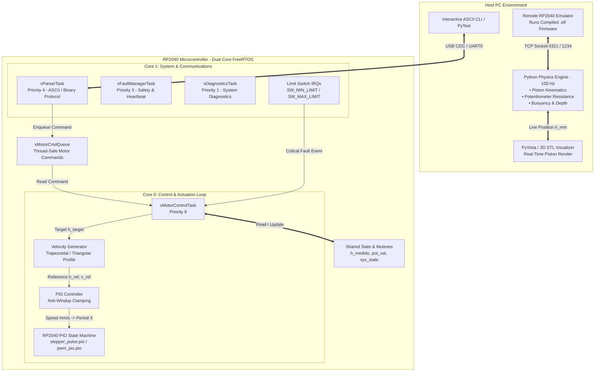
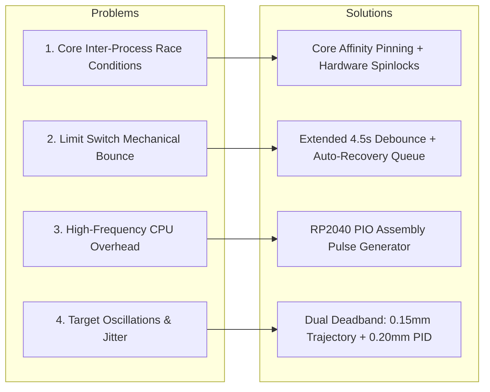
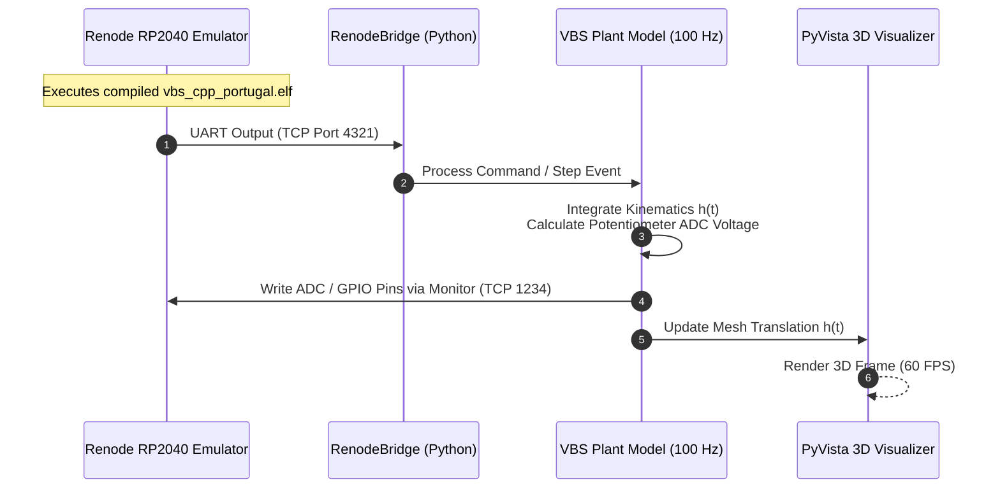

# Variable Buoyancy System (VBS) — Dual-Core FreeRTOS Firmware & HIL Digital Twin

A modular, real-time control system for an underwater AUV **Variable Buoyancy System (VBS)**. This repository contains the production C++ FreeRTOS firmware targeting the **Raspberry Pi Pico (RP2040)**, a multi-phase **Hardware-in-the-Loop (HIL)** simulator powered by **Renode** and **Python**, and a real-time **3D Digital Twin visualizer**.

---

## 📋 Table of Contents

- [1. System Overview](#1-system-overview)
- [2. System Architecture](#2-system-architecture)
- [3. C++ Firmware (RP2040 / Raspberry Pi Pico)](#3-c-firmware-rp2040--raspberry-pi-pico)
  - [3.1 FreeRTOS Task Architecture & Multicore Affinity](#31-freertos-task-architecture--multicore-affinity)
  - [3.2 Core Modules](#32-core-modules)
  - [3.3 Challenges & Engineering Solutions](#33-challenges--engineering-solutions)
- [4. Digital Twin & HIL Simulator (Renode + Python)](#4-digital-twin--hil-simulator-renode--python)
  - [4.1 3-Phase Execution Roadmap](#41-3-phase-execution-roadmap)
  - [4.2 Renode ARM Instruction Emulator Integration](#42-renode-arm-instruction-emulator-integration)
  - [4.3 Real-Time Python Physics Engine & 3D Visualizer](#43-real-time-python-physics-engine--3d-visualizer)
  - [4.4 Simulation Challenges & Solutions](#44-simulation-challenges--solutions)
- [5. Interactive CLI & Command Reference](#5-interactive-cli--command-reference)
- [6. Getting Started & Build Instructions](#6-getting-started--build-instructions)
  - [6.1 Prerequisites](#61-prerequisites)
  - [6.2 Building C++ Firmware](#62-building-c-firmware)
  - [6.3 Running the Simulation Modes](#63-running-the-simulation-modes)

---

## 1. System Overview

The **Variable Buoyancy System (VBS)** controls the depth and trim of an Autonomous Underwater Vehicle (AUV) by altering its volume through linear piston displacement driven by a NEMA 17 stepper motor and lead screw assembly.

Key capabilities of this project include:
* **Deterministic Dual-Core Control:** Embedded C++ firmware running FreeRTOS SMP on the RP2040 microcontroller (Core 0 for real-time motor control & PID; Core 1 for communications, limit switches, and diagnostics).
* **Offloaded PIO Pulse Generation:** RP2040 Programmable I/O (PIO) state machines generate precise, zero-CPU-overhead pulse-width modulation (PWM) for stepper motor speed control.
* **Trapezoidal & Triangular Trajectory Generation:** Smooth acceleration/deceleration profiles bounded dynamically to eliminate mechanical jerks and resonance.
* **Hardware-in-the-Loop (HIL) & Renode Emulation:** Test the exact compiled `.elf` firmware binary using Renode RP2040 ARM instruction emulation coupled with a Python physical plant model (100 Hz kinematics & buoyancy physics) and 3D visualizer.

---

## 2. System Architecture



---

## 3. C++ Firmware (RP2040 / Raspberry Pi Pico)

The firmware is located under [`src/`](file:///c:/Users/lucas/Variable_buoyancy_system/src) and engineered for maximum determinism, safety, and modularity.

### 3.1 FreeRTOS Task Architecture & Multicore Affinity

The RP2040 dual ARM Cortex-M0+ cores are leveraged using static memory allocation (`xTaskCreateStatic`) and explicit core affinity pinning (`vTaskCoreAffinitySet`):

| Task Name | Core Affinity | Priority | Function & Responsibilities | Source File |
| :--- | :--- | :--- | :--- | :--- |
| `vMotorControlTask` | **Core 0** | `6` (Highest) | Closed-loop PID, trajectory execution, PIO FIFO updates | [`motor_control.cpp`]|
| `vParserTask` | **Core 1** | `4` | Parses USB CDC / UART0 ASCII commands & binary frames | [`task_handlers.cpp`]|
| `vFaultManagerTask` | **Core 1** | `3` | Monitors watchdog timer, limit switch hits, and communication timeouts | [`task_handlers.cpp`]|
| `vDiagnosticsTask` | **Core 1** | `1` (Lowest) | Tracks system metrics, uptime, queue statistics, and error counters | [`task_handlers.cpp`]|

### 3.2 Core Modules

```
src/
├── main.cpp                 # Entry point, initializes hardware & boots FreeRTOS scheduler
├── init/
│   ├── init.cpp             # GPIO, UART0, spinlock, & static FreeRTOS task creation
│   └── init.h               # Hardware definitions and pins
├── core/
│   ├── shared_state.cpp     # Thread-safe global variables (system state, potentiometer values)
│   └── shared_state.h       # Shared data structures and mutex handles
├── motor/
│   ├── motor_control.cpp    # Closed-loop PID, limit switch recovery, PIO clock calculation
│   ├── velocity_generator.cpp # Trapezoidal & Triangular motion profile generator
│   ├── potentiometer_reading.cpp # ADC potentiometer reading, filtering, & calibration
│   └── pwm_pio.pio          # Assembly program for RP2040 PIO pulse generation
├── comms/
│   ├── protocol.cpp         # ASCII string parser & binary packet framer
│   └── protocol.h           # Communication structures
└── tasks/
    ├── task_handlers.cpp    # FreeRTOS task implementations & CLI command processing
    └── task_handlers.h      # Task prototypes
```

#### Motor Control & PIO Frequency Calculation
The stepper motor velocity $v_{\text{mm/s}}$ is converted into step frequency $f_{\text{step}} = v_{\text{mm/s}} \times \text{STEPS}\_\text{PER}\_\text{MM}$. The PIO state machine counts clock cycles for high/low states:

$$X = \frac{f_{\text{pio}}}{2 \cdot f_{\text{step}}}$$

Where $f_{\text{pio}} = 1.0\,\text{MHz}$ (configured via clock divider $125.0$). The computed integer period count $X$ is pushed to the PIO TX FIFO, achieving smooth $50\%$ duty-cycle pulses and variable frequency by changing the $X$ without blocking CPU execution.

#### Velocity Profile Generator (`velocity_generator.cpp`)
Calculates smooth target trajectories $h_{\text{ref}}(t)$ and velocity references $v_{\text{ref}}(t)$:
* **Trapezoidal Profile:** Selected when target displacement $\Delta h \ge d_{\text{accel}\_\text{decel}}$. Has acceleration phase ($t_1$), constant speed phase ($t_2$), and deceleration phase ($t_3$).
* **Triangular Profile:** Automatically selected for short moves ($\Delta h < d_{\text{accel}\_\text{decel}}$) where the motor cannot reach full maximum velocity $v_{\text{max}}$.
* **Deadband Check:** Disables trajectory generation for movements $< 0.15\,\text{mm}$ to prevent actuator chatter.

---

### 3.3 Challenges & Engineering Solutions



#### Problem 1: Race Conditions Between Dual Cores
* **Issue:** Core 0 (Motor Control) and Core 1 (Serial Parsing / Interrupts) concurrently access potentiometer readings ($h_{\text{medido}}$) and motor states, causing memory corruption under high telemetry loads.
* **Solution:** Motor control task is pinned strictly to **Core 0**, while communications run on **Core 1**. Access to shared variables is guarded by hardware spinlocks (`vbs_shared_lock`) wrapped using `__wrap_spin_lock_blocking` and FreeRTOS critical sections.

#### Problem 2: Mechanical Limit Switch Bounce & Emergency Lockouts
* **Issue:** Physical limit switch signals produced high-frequency mechanical bounce, causing double-faults and trapping the motor at end-stops.
* **Solution:** Extended software debouncing window ($4.5\,\text{s}$ during long travel) in `gpio_limit_switches_callback`. On confirmed limit switch hits, `treat_fault_limit` automatically triggers emergency stop, resets command queues, and queues an explicit **8,188 step recovery movement** in the opposite direction to pull the piston back into safe territory.

#### Problem 3: CPU Jitter During High Step Frequencies
* **Issue:** Generating step pulses using traditional software timers or bit-banging caused severe step loss when USB/UART interrupt loads spiked.
* **Solution:** Offloaded pulse generation to RP2040 PIO state machine ([`pwm_pio.pio`]). The C++ task only updates the period register $X$ when velocity changes.

#### Problem 4: Small-Amplitude Target Oscillations
* **Issue:** Sensor noise from the feedback potentiometer caused the closed-loop PID controller to continuously hunt around the setpoint.
* **Solution:** Implemented dual-stage deadbanding:
  1. Trajectory generator suppresses moves under **$0.15\,\text{mm}$**.
  2. PID controller applies a **$0.20\,\text{mm}$ error deadband**, clearing integral accumulation when within range.

---

## 4. Digital Twin & HIL Simulator (Renode + Python)

To enable zero-risk development without physical hardware, a digital twin simulation pipeline was developed under [`renode/`] and [`simulation/`].

### 4.1 3-Phase Execution Roadmap

```
 ┌─────────────────────────────────────────────────────────┐
 │ Phase 1: Pure Digital Twin & MCU Emulation (Software)   │
 │ • Run firmware inside Renode / Python virtual MCU       │
 │ • Validate serial protocols, tasks, & trajectory math   │
 └────────────────────────────┬────────────────────────────┘
                              │
                              ▼
 ┌─────────────────────────────────────────────────────────┐
 │ Phase 2: Dual Raspberry Pi Pico HIL Setup               │
 │ • Pico #1 = Target VBS Controller (FreeRTOS Firmware)   │
 │ • Pico #2 = Real-Time Plant Physics Simulator           │
 │ • Wire-to-wire signal loop & automated Python testing   │
 └────────────────────────────┬────────────────────────────┘
                              │
                              ▼
 ┌─────────────────────────────────────────────────────────┐
 │ Phase 3: Hybrid Hardware Bench Test & 3D Visualization  │
 │ • Connect PyVista / Three.js 3D STL Visualizer          │
 │ • Connect physical NEMA 17 + Driver + Battery + Pot     │
 └─────────────────────────────────────────────────────────┘
```

---

### 4.2 Renode ARM Instruction Emulator Integration

Renode simulates the ARM Cortex-M0+ instruction set of the RP2040, executing the exact compiled binary [`build/vbs_cpp_portugal.elf`].



* **Script Files:**
  * [`renode/vbs_pico.repl`] Memory map & peripheral definitions for RP2040 (Cortex-M0+, SRAM, UART0, GPIO).
  * [`renode/vbs_simulation.resc`] Renode startup script, loads ELF, connects UART to TCP port `4321`.
  * [`renode/run_renode.ps1`] PowerShell script for automated launching on Windows.

---

### 4.3 Real-Time Python Physics Engine & 3D Visualizer

Located in [`simulation/`]:

* **`vbs_plant.py` (Plant Physics Model - 100 Hz):**
  Integrates physical motion parameters:
  * Linear position $h(t)$, velocity $v(t)$, and piston displacement volume $V(t) = \pi r^2 h(t)$.
  * Archimedes buoyancy force $F_b = \rho_{\text{water}} \cdot V(t) \cdot g$.
  * Emulated potentiometer resistance and analog ADC voltage generation ($0.0\,\text{V} - 3.3\,\text{V}$).
  * Limit switch state evaluation at minimum ($0\,\text{mm}$) and maximum ($100\,\text{mm}$) bounds.
* **`render_3d.py` (3D Visualizer - 60 FPS):**
  Uses **PyVista** to import `mount.stl` and `piston.stl` meshes, rendering real-time linear translation based on $h(t)$ telemetry.
* **`renode_bridge.py` & `serial_bridge.py`:**
  Provides TCP/Serial socket abstraction to bridge Python telemetry with Renode or physical USB-serial ports.

---

### 4.4 Simulation Challenges & Solutions

#### Problem 1: Time Synchronization Between Emulator & Physics Loop
* **Issue:** Renode instruction execution speed varies based on host CPU load, causing Python physics integration ($100\,\text{Hz}$) to drift out of sync with firmware timer ticks.
* **Solution:** Implemented timestamped event synchronization in `RenodeBridge`, using delta-time scaling ($\Delta t$) calculated from incoming telemetry headers rather than wall-clock time.

#### Problem 2: Emulating Analog Potentiometer Feedback without Hardware ADCs
* **Issue:** Microcontroller emulation environment lacks physical analog voltage input.
* **Solution:** `RenodeBridge` injects raw simulated ADC raw counts directly into the memory-mapped ADC register or via custom UART telemetry string hooks, allowing the closed-loop firmware PID controller to operate seamlessly.

---

## 5. Interactive CLI & Command Reference

The system provides an interactive ASCII command line over USB CDC / UART0:

| Command Syntax | Parameters | Description & Purpose |
| :--- | :--- | :--- |
| `move_pot <target_mm>` | `<target_mm>`: Position in mm ($0 - 100$) | Closed-loop movement to target position using trapezoidal profile & PID |
| `move_constant <steps>` | `<steps>`: Signed step count | Open-loop relative pulse movement (positive = expand, negative = contract) |
| `pot` | None | Reads and displays current potentiometer position ($h_{\text{medido}}$) and ADC raw count |
| `diag` | None | Displays system uptime, task execution counters, fault logs, and queue metrics |
| `stop` | None | Emergency motor stop; disables PIO pulses immediately |
| `enable` | None | Enables stepper driver output (`PIN_ENABLE_DRIVER` = LOW) |
| `disable` | None | Disables stepper driver output (`PIN_ENABLE_DRIVER` = HIGH) |
| `help` | None | Prints available ASCII command list and usage |

---

## 6. Getting Started & Build Instructions

### 6.1 Prerequisites

Ensure the following tools are installed:
* **C++ Compiler:** ARM GCC Toolchain (`arm-none-eabi-gcc` 14.2+)
* **Build System:** [CMake](https://cmake.org/) (3.13+) and [Ninja](https://ninja-build.org/)
* **SDK:** [Raspberry Pi Pico SDK](https://github.com/raspberrypi/pico-sdk) (v2.2.0)
* **Emulation (Optional):** [Renode](https://renode.io/)
* **Python Environment:** Python 3.10+ (Dependencies in `requirements.txt`)

### 6.2 Building C++ Firmware

```powershell
# 1. Clone the repository
git clone https://github.com/Lucas-Barcaro190/Variable_buoyancy_system.git
cd Variable_buoyancy_system

# 2. Configure CMake with Ninja
cmake -B build -G Ninja

# 3. Compile the C++ firmware binary (.elf and .uf2)
cmake --build build
```

The compiled binaries will be generated at:
* `build/vbs_cpp_portugal.elf`
* `build/vbs_cpp_portugal.uf2`

---

### 6.3 Running the Simulation Modes

First, install Python dependencies:
```powershell
pip install -r requirements.txt
```

#### Mode A: 100% Pure Python Virtual MCU (Default)
Runs a pure Python virtual MCU and 3D visualizer without needing external emulators:
```powershell
python simulation/main.py --mode=virtual
```

#### Mode B: Renode RP2040 Instruction Emulator
1. **Launch Renode:**
   ```powershell
   .\renode\run_renode.ps1
   ```
2. **Launch Python HIL Bridge & 3D Visualizer:**
   ```powershell
   python simulation/main.py --mode=renode
   ```

#### Mode C: Physical Hardware-in-the-Loop (HIL)
Connect Raspberry Pi Pico via USB and run:
```powershell
python simulation/main.py --mode=hil --port=COM3
```

---

## 📄 License & Maintainers

Developed by **Lucas Barcaro** for Variable Buoyancy System (VBS) research and development.
