# Diagrama de Atividades - Variable Buoyancy System (VBS)

Este documento apresenta o fluxo de atividades e decisões do sistema VBS, abrangendo a inicialização do FreeRTOS, a separação multicore entre **Core 0** e **Core 1**, a leitura de sensores, a geração de trajetória trapezoidal/triangular, o controle PID e o acionamento via PIO.

---

## Diagrama de Atividades do Sistema

```mermaid
flowchart TD
    Start([Início / Power On]) --> InitHW["Inicializar Hardware: stdio, ADC, GPIOs, Spinlocks e PIO pwm_pio"]
    InitHW --> InitRTOS["Inicializar Tarefas FreeRTOS & Fila xMotorCmdQueue"]
    InitRTOS --> PinCores["Afinidade de Núcleos:<br/>Core 0: MotorControlTask<br/>Core 1: Parser, FaultMgr, Diags"]
    PinCores --> StartScheduler["Iniciar FreeRTOS Scheduler"]

    StartScheduler --> ForkCore0["Iniciar Core 0"]
    StartScheduler --> ForkCore1["Iniciar Core 1"]

    subgraph Core1 ["Core 1: Comunicação & Monitoramento"]
        ForkCore1 --> ParserLoop["Aguardar Comando Serial USB/UART"]
        ParserLoop --> CheckRx{"Comando Recebido?"}
        CheckRx -- Não --> ParserLoop
        CheckRx -- Sim --> ValidateCmd["Validar Comando e Checksum CRC8"]
        ValidateCmd --> BuildCmdStruct["Montar estrutura MotorCmd_t"]
        BuildCmdStruct --> SendQueue["Postar comando na Fila xMotorCmdQueue"]
        SendQueue --> ParserLoop
    end

    subgraph Core0 ["Core 0: Malha de Controle de Alta Prioridade (20 Hz / 50ms)"]
        ForkCore0 --> TaskLoop["Início do Período de 50ms"]
        TaskLoop --> CheckLimitSw{"Fim de Curso Atingido?<br/>(flag_min_hit / flag_max_hit)"}
        
        %% Tratamento de Emergência
        CheckLimitSw -- Sim --> SetFaultState["Set SYS_CRITICAL_ERROR & Parar PIO"]
        SetFaultState --> RecuoSafety["Acionar Recuo de Segurança 0.5 mm/s"]
        RecuoSafety --> ClearFlags["Limpar Flags e Restaurar SYS_OPERATIONAL"]
        ClearFlags --> TaskLoop

        %% Leitura Normal
        CheckLimitSw -- Não --> ReadPot["Amostrar Potenciômetro via ADC (128 amostras)"]
        ReadPot --> CalcPos["Calcular Posição Medida h_medido (mm) e Volume (cm³)"]

        %% Fila de Comandos
        CalcPos --> CheckQueue{"Novo Comando na Fila?"}
        CheckQueue -- Sim --> PopQueue["Pop da Fila xMotorCmdQueue"]
        PopQueue --> ConvTarget["Converter target_pot para h_target (mm)"]
        ConvTarget --> InitVelGen["velocity_generator_start: Calcular Rampa"]
        
        %% Gerador de Trajetória
        InitVelGen --> CheckDeadband{"Deslocamento menor que 0.15 mm?"}
        CheckDeadband -- Sim --> SetDeadband["Ativar Zona Morta: Manter Parado"]
        CheckDeadband -- Não --> CheckDist{"Distância menor que d_min_trapezoid?"}
        CheckDist -- Sim --> ProfileTriangular["Selecionar Perfil Triangular"]
        CheckDist -- Não --> ProfileTrapezoidal["Selecionar Perfil Trapezoidal"]
        
        SetDeadband --> ResetPID["Resetar Integrador PID"]
        ProfileTriangular --> ResetPID
        ProfileTrapezoidal --> ResetPID
        ResetPID --> ProcessState

        CheckQueue -- Não --> ProcessState

        %% Processamento do Estado do Motor
        ProcessState{"Estado do Motor?"}
        
        ProcessState -- MCTL_IDLE --> StopPIOAction["Executar stop_stepper_pio"]
        
        ProcessState -- MCTL_MOVING --> SampleTraj["velocity_generator_update: Obter href e vref"]
        SampleTraj --> CalcError["Calcular Erro e = href - h_medido"]
        CalcError --> CheckComplete{"Perfil Concluído E |erro| menor que 0.2 mm?"}
        
        CheckComplete -- Sim --> TargetReached["Parar PIO & Transitar para MCTL_IDLE"]
        
        CheckComplete -- Não --> ComputePID["Calcular v_control via PID Discreto<br/>com Anti-Windup Clamping"]
        ComputePID --> CalcPeriodX["Calcular Direção DIR e Período PIO X<br/>X = (f_pio / (2 * f_step)) - 3"]
        CalcPeriodX --> PushFIFO["Enviar X para o FIFO da PIO"]
        PushFIFO --> PIOHW["PIO: Carregar X no OSR via pull noblock"]

        StopPIOAction --> DelayTick
        TargetReached --> DelayTick
        
        PIOHW --> GenPWM["PIO: Alternar Pino PULSE HIGH/LOW (50% Duty)"]
        GenPWM --> PhysicalMotor["Driver de Passo aciona o Pistão"]
        PhysicalMotor --> DelayTick["Aguardar Próximo Tick (vTaskDelayUntil)"]
        DelayTick --> TaskLoop
    end
```

---

## Descrição dos Nós Principais

1. **Decisões de Trajetória**:
   - `Deslocamento menor que 0.15 mm?`: Se o movimento for menor que a zona morta de $0,15\text{ mm}$, a trajetória permanece inativa para evitar vibrações e ruídos do sensor.
   - `Distância menor que d_min_trapezoid?`: Avalia se o percurso permite atingir a velocidade máxima $v_{max}$. Se não permitir, escolhe o perfil **Triangular**; caso contrário, **Trapezoidal**.

2. **Decisões de Malha PID & Parada**:
   - `Perfil Concluído E |erro| menor que 0.2 mm?`: Verifica se o perfil de velocidade finalizou e se o pistão atingiu a tolerância de erro tolerada para interromper o envio de pulsos ao driver.
