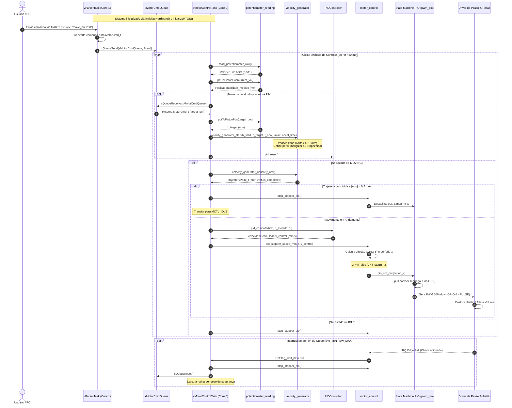

# Diagrama de Sequência - Variable Buoyancy System (VBS)

Este documento ilustra a sequência de execução e a interação entre os componentes de software e hardware do projeto VBS, abrangendo a inicialização do FreeRTOS, a recepção de comandos, a malha de controle no **Core 0**, a comunicação entre tarefas e a geração de pulsos PWM via PIO no RP2040.

---

## Diagrama de Sequência de Execução

---

## Descrição do Fluxo dos Componentes

1. **`vParserTask` (Core 1)**:
   - Recebe linhas de texto ou pacotes binários via USB/UART.
   - Converte os comandos (ex: `move_pot 250`) em estruturas `MotorCmd_t` e as envia para a fila `xMotorCmdQueue`.

2. **`xMotorCmdQueue`**:
   - Fila thread-safe do FreeRTOS que desacopla a recepção de comandos do ciclo de controle.

3. **`vMotorControlTask` (Core 0)**:
   - Executa estritamente no **Core 0** em um loop de alta prioridade a 20 Hz (período de 50 ms).
   - Lê a posição atual do atuador via `potentiometer_reading`.
   - Coleta novos alvos da fila e aciona o `velocity_generator`.
   - Executa o cálculo da malha PID em tempo discreto e comanda o acionamento dos passos via `motor_control`.

4. **`velocity_generator`**:
   - Gera os perfis contínuos de aceleração e desaceleração.
   - Aplica a zona morta de $0,15\text{ mm}$ para evitar ruído.
   - Seleciona automaticamente o perfil **Triangular** em deslocamentos curtos e **Trapezoidal** em deslocamentos longos.

5. **`PIDController`**:
   - Calcula o erro $e(t) = h_{ref} - h_{medido}$.
   - Aplica os termos Proporcional, Integral (com anti-windup) e Derivativo, limitando a velocidade de saída.

6. **`motor_control` e `pwm_pio`**:
   - Converte a velocidade de saída do PID ($mm/s$) em frequência de passos ($Hz$) e no valor de temporização $X$.
   - Alimenta o FIFO do PIO, que gera a onda quadrada (PWM 50% duty cycle) sem sobrecarregar a CPU.
